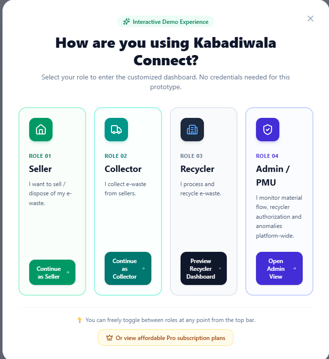
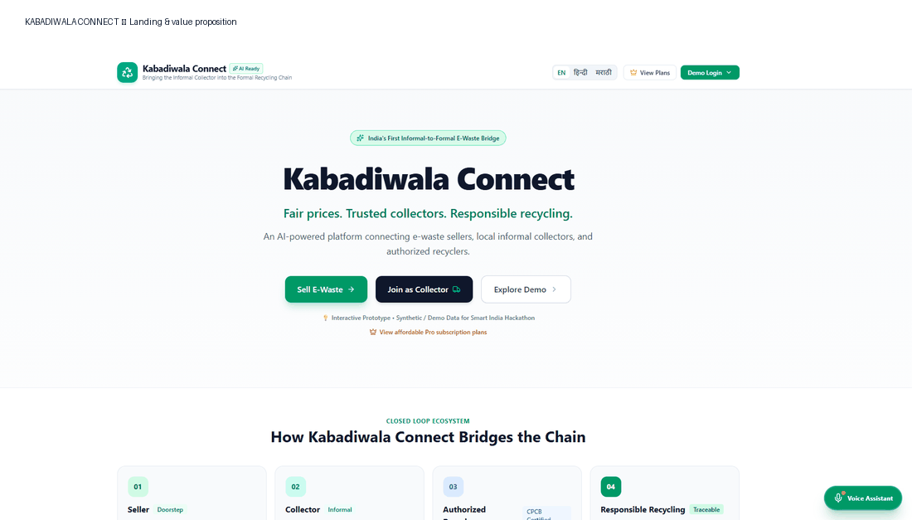
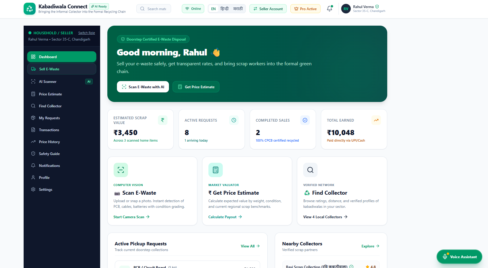
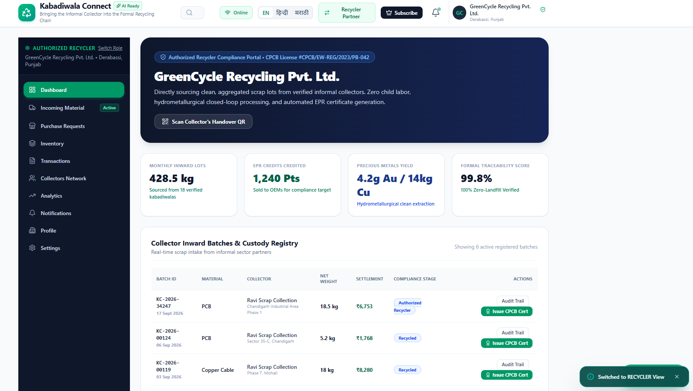
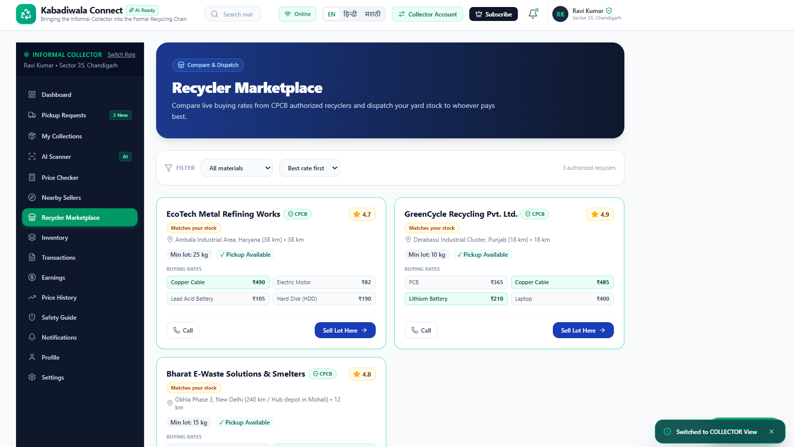
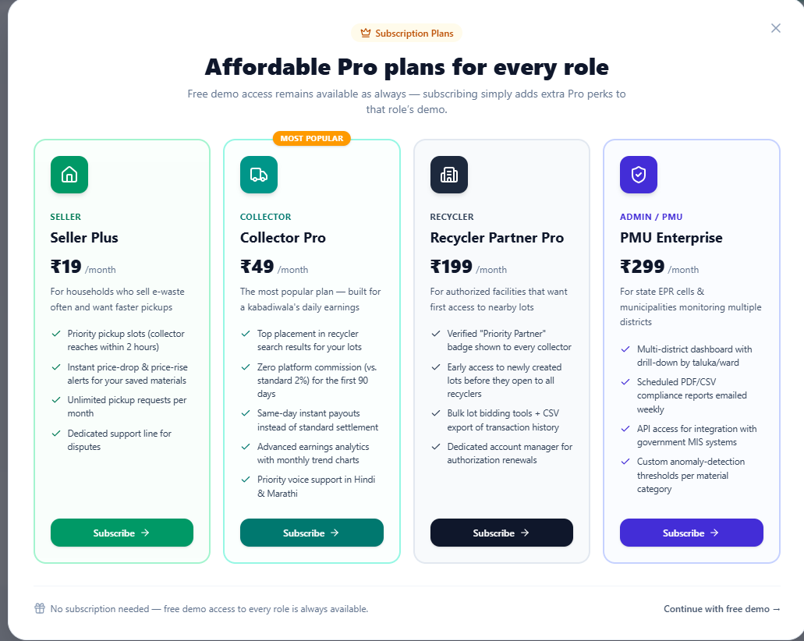
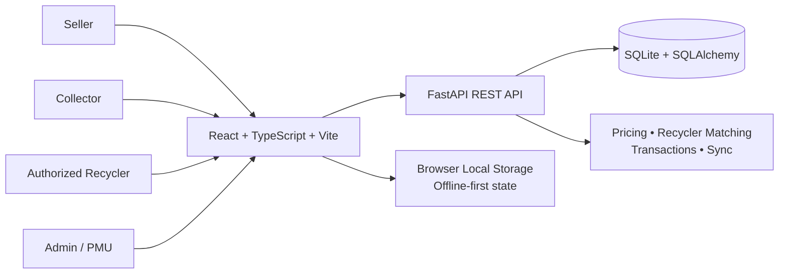

# ♻️ Kabadiwala Connect

<p align="center">
  <strong>Bringing the Informal Collector into the Formal Recycling Chain</strong><br/>
  <sub>AI-assisted • Offline-first • Traceable • Role-based e-waste ecosystem</sub>
</p>

<p align="center">
  
  
  
  
</p>

<p align="center">
  
</p>

> **Kabadiwala Connect** is a hackathon prototype that connects e-waste sellers, informal collectors, and authorized recyclers through a transparent digital workflow — from scrap submission and price estimation to handover, receipt, payment, and earnings tracking.

## ✨ Product at a Glance

| Experience | What the prototype demonstrates |
|---|---|
| 🏠 **Seller** | Submit e-waste, scan material, estimate value, find collectors, request pickup, view transactions and earnings |
| 🚚 **Collector** | Manage pickup requests, inventory, digital weighing, price checking, recycler discovery and marketplace activity |
| ♻️ **Recycler** | Monitor incoming material, inventory, transactions, collector network and compliance-oriented traceability |
| 🛡️ **Admin / PMU** | Platform-level monitoring, material-flow visibility and operational summaries |

## 🎬 Interactive Prototype Preview

<p align="center">
  
</p>

The interface uses role-based dashboards, status indicators, cards, tables, modals, notifications and animated interactions to make the workflow easy to demonstrate.

---

## 🎯 Problem → Solution

### The challenge

E-waste transactions can be fragmented across households, informal collectors and recycling facilities. The prototype focuses on four practical gaps:

- limited price transparency
- difficulty finding suitable/authorized recycling channels
- weak digital records across handovers and payments
- limited access to guided digital tools for informal users

### The proposed solution

**One connected workflow:**

```text
Submit Scrap
     ↓
AI-Assisted Identification
     ↓
Weight + Condition
     ↓
Fair-Price Estimate
     ↓
Collector / Recycler Discovery
     ↓
Price Comparison
     ↓
Handover + Traceability
     ↓
Digital Receipt
     ↓
Payment
     ↓
Earnings / Transaction Ledger
```

---

## 🧩 Core Features

### 🤖 AI-assisted material scanning

- Image-based e-waste scanning experience
- Material and condition suggestions
- Scanner-to-price-estimator flow
- Designed for categories such as PCB, cable/wire, batteries, laptop/computer, motor and HDD

### 💰 Price estimation & comparison

- Material-specific rates
- Weight-based estimation
- Condition-aware valuation
- Historical price views
- Collector-side recycler price checking

### 📍 Recycler discovery

- Recycler compatibility
- Authorization-oriented filtering
- Distance and pickup information in the prototype UI
- Side-by-side buying-rate comparison

### 📦 Digital transaction flow

- Scrap submission
- Pickup request
- Digital weighing
- Handover
- QR/digital receipt generation
- Payment record
- Earnings ledger

### 🎙️ Voice assistance

- Voice-assisted interaction flow
- English/Hindi support in the prototype
- Guided interaction for users who may prefer speaking over typing

### 📱 Offline-first interaction

- Core demo state persists in browser `localStorage`
- Online/offline state is detected
- Locally created requests can be marked as pending sync
- FastAPI backend includes synchronization-oriented APIs

---

## 🔄 15-Step End-to-End Workflow

| # | Stage | User action |
|---:|---|---|
| 01 | Access | Login / Register |
| 02 | Language | Select preferred language |
| 03 | Dashboard | Enter role-based dashboard |
| 04 | Submission | Add e-waste |
| 05 | Evidence | Take / upload photo |
| 06 | Identification | Select or identify material |
| 07 | Weighing | Enter approximate weight |
| 08 | Valuation | Generate estimated value |
| 09 | Discovery | Find authorized recycler / collection route |
| 10 | Comparison | Compare available prices |
| 11 | Selection | Select recycler |
| 12 | Handover | Handover material |
| 13 | Proof | Generate digital receipt |
| 14 | Settlement | Record payment |
| 15 | Tracking | Update earnings / transaction ledger |

---

## 🖥️ Interface Showcase

### Role selection

<p align="center">
  
</p>

### Seller dashboard

<p align="center">
  
</p>

### Recycler dashboard

<p align="center">
  
</p>

### Collector marketplace

<p align="center">
  
</p>

### Subscription / product model preview

<p align="center">
  
</p>

---

## 🏗️ System Architecture



### Technology stack

| Layer | Technology | Role |
|---|---|---|
| Frontend | React + TypeScript | Component-based UI |
| Build | Vite | Development and production build |
| Styling | Tailwind CSS | Responsive interface styling |
| Interaction | Motion | UI transitions and animation |
| Icons | Lucide React | Consistent interface icons |
| AI integration | Google GenAI package | AI-assisted prototype services |
| Backend | FastAPI + Uvicorn | REST API layer |
| Validation | Pydantic | API schemas / validation |
| ORM | SQLAlchemy | Database access |
| Database | SQLite | Local/demo persistence |
| QR | QRCode | Digital receipt support |

---

## 🗂️ Project Structure

```text
kabadiwala-connect/
│
├── backend/
│   ├── app/
│   │   ├── __init__.py
│   │   ├── database.py
│   │   ├── main.py
│   │   ├── models.py
│   │   └── schemas.py
│   ├── requirements.txt
│   ├── seed.py
│   └── README.md
│
├── public/
│   └── assets/
│
├── docs/
│   ├── screenshots/
│   └── kabadiwala-connect-demo.gif
│
├── src/
│   ├── components/
│   │   ├── admin/
│   │   ├── collector/
│   │   ├── common/
│   │   ├── recycler/
│   │   ├── seller/
│   │   └── voice/
│   ├── data/
│   ├── services/
│   ├── utils/
│   ├── App.tsx
│   ├── index.css
│   ├── main.tsx
│   └── types.ts
│
├── .env.example
├── .gitignore
├── index.html
├── package.json
├── package-lock.json
├── tsconfig.json
└── vite.config.ts
```

---

## ⚙️ Run Locally

### 1. Frontend

Prerequisite: **Node.js + npm**

```bash
npm install
npm run dev
```

Frontend:

```text
http://localhost:3000
```

### 2. Backend

Open a second terminal:

```powershell
cd backend
python -m venv venv
venv\Scripts\activate
pip install -r requirements.txt
python seed.py
uvicorn app.main:app --reload --port 8000
```

Backend:

```text
http://127.0.0.1:8000
```

Interactive API documentation:

```text
http://127.0.0.1:8000/docs
```

---

## 🔌 Backend API Surface

The FastAPI backend currently exposes prototype endpoints covering areas such as:

| Area | Example endpoints |
|---|---|
| Collectors | `POST /collector` |
| Scrap lots | `POST /lot` |
| Pricing | `GET /prices`, `GET /prices/estimate` |
| Recycler discovery | `GET /recyclers`, `GET /recyclers/match/{lot_id}` |
| Quotes | `POST /quote` |
| Transactions | `POST /transaction` |
| Handover | `POST /handover` |
| Payments | `POST /payment` |
| Earnings | `GET /ledger/{collector_id}` |
| Sync | `POST /sync` |
| Safety | `GET /safety-guides` |
| Admin | `GET /admin/summary` |

> API availability and behavior can evolve as the prototype is integrated further.

---

## 🔐 Configuration & Security Notes

- Keep secrets in environment variables; do not commit `.env` files.
- `.env.example` is included as a configuration reference.
- The current project is a **prototype**, so authentication, authorization, production database hardening and secret management should be strengthened before real-world deployment.
- Demo/sample identities and figures shown in the UI are synthetic prototype data.

---

## 🛣️ Future Scope

- Production-grade authentication and role authorization
- Persistent PostgreSQL deployment
- Real-time collector/recycler availability
- Verified recycler onboarding and compliance workflows
- Stronger image classification model with a curated e-waste dataset
- Multilingual voice UX for more Indian languages
- UPI/payment gateway integration
- Geospatial route optimization
- Analytics dashboards for municipalities / EPR monitoring
- Cloud deployment with monitoring, logging and automated backups

---

## 🏆 Hackathon Demonstration Flow

For a live demo, the cleanest story is:

```text
Landing Page
   ↓
Choose Seller
   ↓
AI Scanner
   ↓
Price Estimate
   ↓
Find Collector
   ↓
Pickup / Handover
   ↓
Digital Receipt
   ↓
Payment & Earnings
   ↓
Switch to Collector
   ↓
Recycler Marketplace
   ↓
Switch to Recycler
   ↓
Traceability / Compliance View
```

This keeps the demo focused on the **informal-to-formal recycling bridge** rather than showing isolated screens.

---

## 👥 Team

**Kabadiwala Connect** — Smart India Hackathon prototype.

> Team details, member names and institutional information can be added here before final submission.

---

<p align="center">
  <strong>♻️ From Scrap to Sustainable Value</strong><br/>
  <sub>Kabadiwala Connect • Interactive Prototype</sub>
</p>

